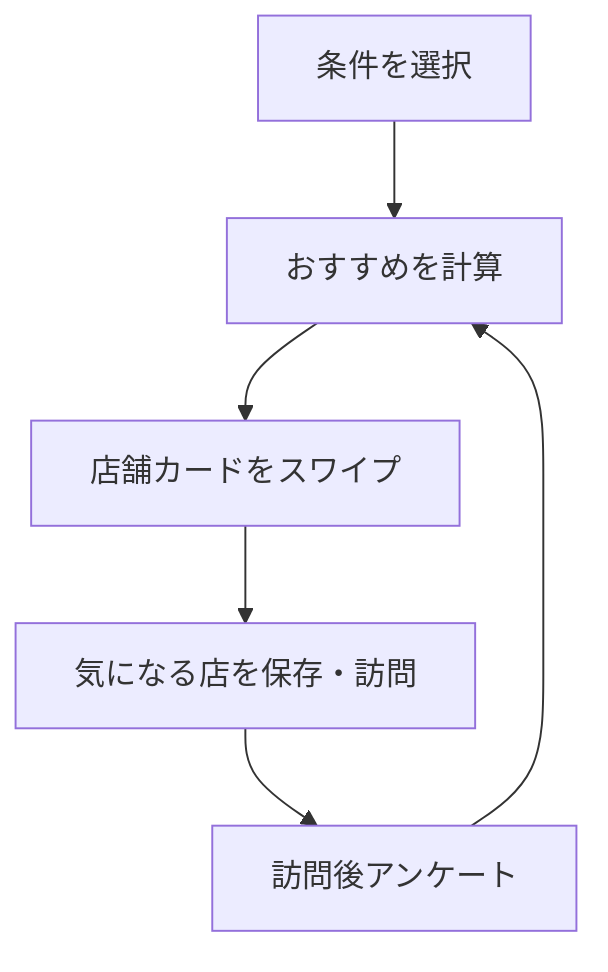
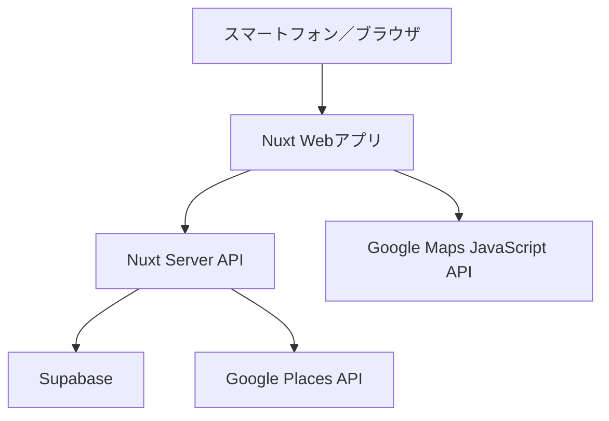

# 外食レコメンドアプリ MVP仕様書

| 項目 | 内容 |
| --- | --- |
| 文書バージョン | 1.0 |
| 作成日 | 2026-09-06 |
| MVP対象地域 | 大阪 |
| 想定プラットフォーム | スマートフォン中心のWebアプリ |
| フロント／Webフレームワーク | Nuxt 4 / Vue / TypeScript |
| データベース・認証・画像保存 | Supabase |
| 地図・店舗情報 | Google Maps Platform |

---

## 1. プロダクト概要

### 1.1 コンセプト

ユーザーが飲食店一覧から検索するのではなく、最初に食べたいジャンル、人数、利用目的、予算を選び、その条件に合う店舗をカード形式で順番に提示するWebアプリとする。

ユーザーは店舗カードを左右にスワイプし、気になる店舗を保存できる。実際に利用した後は、良かった点・気になった点をアンケート形式で回答でき、その結果を以降の推薦順位に反映する。

### 1.2 提供価値

- 多数の検索結果を比較する負担を減らす
- 利用人数や目的に合った店舗を直感的に発見できる
- 一般的な人気順ではなく、ユーザー個人の好みに合わせて推薦できる
- 推薦理由を表示し、なぜその店が提示されたのかを理解できる
- 店舗の基本情報はGoogleと連携しつつ、独自の推薦理由や属性を提供する

### 1.3 基本体験



---

## 2. 対象範囲

### 2.1 MVPで実装する範囲

- 対象地域は大阪のみ
- ジャンル、人数、利用目的、予算の選択
- 条件に基づく店舗推薦
- 料理写真を中心としたスワイプカード
- 右スワイプ、左スワイプ、詳細表示
- 気になる店舗の保存
- 店舗詳細表示
- Googleマップ表示またはGoogleマップへの遷移
- 「行った」登録
- 訪問後アンケート
- スワイプ・アンケート履歴を用いた個人向け推薦の更新
- 管理者による店舗、画像、属性、推薦コメントの登録・編集
- 匿名セッションと任意ログイン

### 2.2 MVPでは実装しない範囲

- 店舗予約・決済
- 店舗事業者向け管理画面
- ユーザー間のフォローやSNS機能
- 自由記述レビューの一般公開
- コメントへの「いいね」や返信
- 本格的な機械学習モデル
- プッシュ通知
- 現在地からのリアルタイム距離計算
- 大阪以外の都市の公開

### 2.3 将来追加する都市

1. 東京
2. 福岡
3. 熊本
4. 名古屋
5. 上海
6. ソウル
7. 釜山

都市追加時にデータ構造を変更しなくて済むよう、MVP段階から国、言語、通貨、タイムゾーンを都市データとして保持する。

---

## 3. 想定ユーザー

### 3.1 主な対象

- 行きたい店が明確に決まっていない人
- 検索結果を何十件も比較することが面倒な人
- 一人でも入りやすい店を探している人
- デート、友人との食事、観光など、目的に合う店を探している人
- 自分の好みに合った新しい店を発見したい人

### 3.2 代表的な利用場面

- 「大阪で一人で入れる1,500円程度のラーメン店を探したい」
- 「友人3人で、会話しやすい居酒屋を探したい」
- 「デート向きだが高すぎない店を探したい」
- 「以前気に入った店と似た雰囲気の店を探したい」

---

## 4. ユーザーフロー

### 4.1 初回利用

1. トップ画面を開く
2. 食べたいジャンルを選択する
3. 利用人数を選択する
4. 利用目的を選択する
5. 予算を選択する
6. 「おすすめを見る」を押す
7. 推薦カードをスワイプする
8. 気になる店舗を保存する
9. 店舗詳細や地図を確認する

### 4.2 訪問後

1. 保存済み店舗または店舗詳細から「行った」を押す
2. 訪問後アンケートに回答する
3. 回答内容をユーザーの好みと店舗の評価に反映する
4. 次回以降の推薦順位を更新する

### 4.3 ログイン方針

- 条件選択とスワイプはログインなしで利用可能とする
- 未ログイン時はブラウザのローカルストレージと匿名`session_id`で履歴を保持する
- お気に入りを別端末でも利用したい場合や訪問後アンケートを継続保存したい場合にログインを案内する
- ログイン後、可能な範囲で匿名セッションの履歴をユーザーアカウントへ統合する
- MVPのログイン方式はメールのマジックリンクを第一候補とする

---

## 5. 画面仕様

### 5.1 トップ・条件選択画面

#### 目的

推薦に必要な初期条件を、負担を感じさせずに取得する。

#### 表示要素

- サービス名・ロゴ
- 大阪らしい料理や看板メニューのヒーロー画像
- 短い説明文
- ジャンル選択
- 人数選択
- 利用目的選択
- 予算選択
- 「おすすめを見る」ボタン

#### 入力項目

| 項目 | 選択方式 | 選択肢 |
| --- | --- | --- |
| ジャンル | 複数選択 | ラーメン、寿司・海鮮、焼肉、居酒屋、カフェ、洋食、中華、韓国料理、こだわらない |
| 人数 | 単一選択 | 1人、2人、3〜4人、5人以上 |
| 利用目的 | 単一選択 | 普段の食事、友人、デート、家族、観光、仕事・会食、飲み会 |
| 予算 | 単一選択 | 1,000円以下、1,000〜2,000円、2,000〜4,000円、4,000円以上、こだわらない |

#### バリデーション

- ジャンル未選択時は「こだわらない」と同等に扱う
- 人数は必須とする
- 利用目的は未選択でも進める
- 予算未選択時は「こだわらない」と同等に扱う

### 5.2 推薦・スワイプ画面

#### 表示要素

- 料理を主役にしたメイン画像
- 店名
- 大阪市内のエリア名
- 予算目安
- ジャンル
- 店舗の特徴タグを最大3件
- 独自の推薦コメント
- 「あなたへのおすすめ理由」
- 左スワイプボタン
- 右スワイプボタン
- 詳細表示ボタン
- 進行中のローディング・通信エラー表示

#### 操作

| 操作 | 意味 | システム処理 |
| --- | --- | --- |
| 右スワイプ | 気になる | お気に入りに追加し、好みの属性へプラス反映 |
| 左スワイプ | 今回は見送る | 現セッションでは再表示せず、好みへのマイナス反映は弱くする |
| カードタップ | 詳細を見る | 店舗詳細画面へ遷移し、閲覧履歴を保存 |
| 戻す | 直前の操作を取り消す | MVPでは直前1件のみ対応してもよい |

#### 読み込み方式

- 初回に最大20件をまとめて取得する
- 残り5件以下になった時点で次の候補を先読みする
- API通信中でも現在のカード操作が止まらないようにする
- 同一セッション内で左スワイプした店舗は再表示しない

### 5.3 店舗詳細画面

#### 表示要素

- 料理画像
- 店名
- 独自の紹介文・おすすめ理由
- 住所
- 営業時間
- 予算目安
- ジャンル・属性タグ
- Google評価を表示する場合はGoogle由来であることが分かる表記
- 地図
- 「Googleマップで見る」ボタン
- 「気になる」ボタン
- 「行った」ボタン

### 5.4 気になる店舗画面

- 右スワイプした店舗を一覧表示する
- 店舗詳細への遷移
- 保存解除
- 「行った」登録
- MVPではユーザー独自のフォルダ分けは行わない

### 5.5 訪問後アンケート画面

#### 必須項目

| 項目 | 形式 |
| --- | --- |
| 総合満足度 | 1〜5 |
| また行きたいか | はい／どちらともいえない／いいえ |
| 誰と行ったか | 1人、友人、恋人、家族、仕事関係、その他 |

#### 良かった点

- 味
- コストパフォーマンス
- 雰囲気
- 接客
- 量
- アクセス
- 一人で入りやすい
- 落ち着いて話せる
- 写真映え
- 提供が早い

#### 気になった点

- 値段が高い
- 混雑している
- 騒がしい
- 待ち時間が長い
- 量が少ない
- 量が多すぎる
- 一人では入りにくい
- 駅から遠い
- 期待した味と違った
- 接客が気になった

#### 任意項目

- 自由記述メモ
- 実際に利用した時間帯
- 実際の支払額帯

#### 公開範囲

- MVPではアンケート結果を公開口コミとして表示しない
- 自由記述も本人の記録と推薦改善のためにのみ保存する
- 将来公開レビューを追加する場合は、別途公開同意、通報、管理者審査機能を設ける

### 5.6 管理画面

#### 機能

- 管理者ログイン
- 店舗一覧・検索
- 店舗の新規登録・編集・非公開化
- Google Placesで店舗を検索し、外部Place IDを紐付ける
- 料理画像のアップロード
- カバー画像の選択
- ジャンル・属性タグの設定
- 人数、利用目的、予算への適合度設定
- 独自紹介文・推薦理由の入力
- 基本おすすめ度の入力
- アンケート集計の閲覧

---

## 6. 画像・デザイン方針

### 6.1 画像方針

- トップ画像は店頭外観ではなく、料理、看板メニュー、複数料理を並べたテーブル写真を使用する
- スワイプカードは料理写真を最優先する
- 店舗外観や内装は店舗詳細画面の補助画像として使用する
- Google Placesの先頭写真を自動的にカバー画像にしない
- 運営側が使用権を確認した画像をSupabase Storageに保存し、明示的にカバー画像を選択する
- Google由来の画像を使用する場合は、表示条件、帰属表示、保存制限を遵守する

### 6.2 UI方針

- スマートフォンで片手操作できることを優先する
- 料理画像を大きく表示し、文字情報を載せすぎない
- スワイプ操作だけに依存せず、左右ボタンも配置する
- 左操作は拒絶的な赤色を強く使わず「今回は見送る」と表現する
- 右操作は「気になる」と表現する
- カード下部には画像上でも読めるグラデーションを設ける
- 最も重要な情報は店名、料理、予算、おすすめ理由とする

### 6.3 アクセシビリティ

- 主要操作はキーボードとボタンでも実行可能にする
- 画像に代替テキストを設定する
- 文字と背景のコントラストを確保する
- 色だけで選択状態や評価を表現しない
- スワイプアニメーションを抑える設定を考慮する

---

## 7. 推薦ロジック

### 7.1 MVPの基本方針

本格的な機械学習は使用せず、以下を組み合わせたスコアリング方式とする。

1. 運営が設定した基本おすすめ度
2. 初回に選択した条件との一致度
3. ユーザーの過去のスワイプ・訪問履歴
4. 訪問後アンケートから得た好み
5. 他ユーザーのアンケートを集計した店舗品質

### 7.2 候補の抽出

以下を必須条件として候補を抽出する。

- 選択された都市に属する
- 公開状態である
- 閉店・一時停止状態ではない
- 現セッションで既に表示済みではない
- ブロック・非表示指定されていない

ジャンル、人数、利用目的、予算は原則として完全除外条件ではなく、推薦順位を変える条件として扱う。完全一致が少ない場合でも結果が0件になりにくくするためである。

### 7.3 初期スコア例

```text
recommendation_score
= editorial_score × 2
+ genre_match × 4
+ party_size_match × 3
+ occasion_match × 3
+ budget_match × 2
+ personal_attribute_score
+ aggregate_satisfaction_score × 2
- recent_skip_penalty
```

数値は初期値であり、実データと利用状況を確認しながら調整する。

### 7.4 行動の扱い

| 行動 | 初期の重み | 補足 |
| --- | ---: | --- |
| 右スワイプ | +2.0 | 店舗の属性を好みとして加算 |
| 詳細閲覧 | +0.3 | 興味はあるが明確な好みとは限らない |
| 左スワイプ | -0.2 | 「嫌い」ではなく「今回は違う」として弱く扱う |
| 行った登録 | +1.0 | 実際の関心として扱う |
| 満足度5 | +3.0 | 良かった点の属性を強く加算 |
| 満足度4 | +1.5 | 良かった点の属性を加算 |
| 満足度3 | 0 | 中立 |
| 満足度2 | -1.5 | 気になった点に対応する属性を減算 |
| 満足度1 | -3.0 | 気になった点に対応する属性を強く減算 |

### 7.5 ユーザー嗜好

店舗には次のような属性を持たせ、ユーザーにも属性ごとの重みを保持する。

- `quiet`
- `lively`
- `solo_friendly`
- `counter_seats`
- `good_value`
- `large_portions`
- `quick_service`
- `date_friendly`
- `group_friendly`
- `near_station`
- `photogenic`
- `spicy`

例として、「落ち着いて話せた」を高評価した場合は`quiet`と`date_friendly`を加算する。「騒がしかった」を気になった点として選択した場合は`lively`の重みを下げる。

### 7.6 全体評価

- 単純平均だけで順位を決めない
- 回答数が少ない店舗が極端に上位にならないよう、将来的にはベイズ平均を使用する
- 回答数が一定数未満の場合は運営の基本おすすめ度を強く反映する
- 個人向け推薦と全体的な店舗品質を別々に計算する

### 7.7 探索枠

推薦の固定化を防ぐため、提示カードの10〜15%は通常より少し異なるジャンルや属性から選ぶ。探索枠でも都市、営業状態、極端な予算不一致などの基本条件は維持する。

### 7.8 推薦理由

推薦APIはスコアだけでなく、上位の一致理由を最大2件返す。

例：

- 「一人利用に向いたカウンター席のあるお店です」
- 「以前高評価した静かでコスパの良いお店と特徴が似ています」
- 「選択した焼肉・2,000〜4,000円の条件に合っています」

---

## 8. システム構成



### 8.1 技術スタック

| 分類 | 技術 | 用途 |
| --- | --- | --- |
| 言語 | TypeScript | フロント・サーバー共通 |
| フレームワーク | Nuxt 4 | 画面、ルーティング、SSR、API |
| UI | Vue / Nuxt UI またはTailwind CSS | コンポーネント・スタイル |
| 状態管理 | Nuxt composables | 条件、セッション、カード状態 |
| DB | Supabase PostgreSQL | 店舗、履歴、推薦データ |
| 認証 | Supabase Auth | ユーザー・管理者認証 |
| 画像保存 | Supabase Storage | 料理画像 |
| 地図 | Maps JavaScript API | 地図・店舗位置表示 |
| 店舗情報 | Places API（New） | 店名、住所、営業時間など |
| 外部地図遷移 | Maps URLs | Googleマップアプリへの遷移 |
| ホスティング | Vercel | Nuxtアプリの公開 |
| バージョン管理 | GitHub | ソースコード管理 |

### 8.2 Nuxtディレクトリ案

```text
app/
├── pages/
│   ├── index.vue
│   ├── recommendations.vue
│   ├── restaurants/[slug].vue
│   ├── favorites.vue
│   ├── visits.vue
│   ├── feedback/[visitId].vue
│   └── admin/
│       ├── index.vue
│       └── restaurants/[id].vue
├── components/
│   ├── onboarding/
│   ├── recommendation/
│   │   ├── RestaurantCard.vue
│   │   ├── SwipeDeck.vue
│   │   └── RecommendationReason.vue
│   ├── restaurant/
│   └── feedback/
├── composables/
│   ├── useRecommendationSession.ts
│   ├── useSwipe.ts
│   └── useAuth.ts
└── middleware/
    └── admin.ts

server/
├── api/
│   ├── recommendations.post.ts
│   ├── actions/swipe.post.ts
│   ├── favorites/
│   ├── restaurants/[slug].get.ts
│   ├── visits.post.ts
│   ├── feedback.post.ts
│   └── admin/
└── services/
    ├── recommendation.ts
    ├── places.ts
    └── user-preferences.ts

shared/
├── types/
└── constants/
```

---

## 9. データベース仕様

すべての主要IDはUUIDを使用する。日時はUTCで保存し、表示時に都市のタイムゾーンへ変換する。

### 9.1 `cities`

| カラム | 型 | 内容 |
| --- | --- | --- |
| id | uuid | 主キー |
| name | text | 表示名 |
| slug | text unique | URL・API用識別子 |
| country_code | char(2) | `JP`、`CN`、`KR`など |
| default_locale | text | `ja`、`zh-CN`、`ko`など |
| currency | char(3) | `JPY`、`CNY`、`KRW`など |
| timezone | text | `Asia/Tokyo`など |
| is_active | boolean | 公開状態 |

### 9.2 `areas`

| カラム | 型 | 内容 |
| --- | --- | --- |
| id | uuid | 主キー |
| city_id | uuid | 都市ID |
| parent_id | uuid nullable | 親エリア |
| name | text | 梅田、難波など |
| slug | text | URL用識別子 |
| sort_order | integer | 表示順 |

### 9.3 `restaurants`

| カラム | 型 | 内容 |
| --- | --- | --- |
| id | uuid | 主キー |
| city_id | uuid | 都市ID |
| area_id | uuid | エリアID |
| slug | text unique | 詳細URL用 |
| display_name | text | 店名 |
| description | text | 独自紹介文 |
| recommendation_text | text | 推薦コメント |
| price_min | integer nullable | 最低予算目安 |
| price_max | integer nullable | 最高予算目安 |
| currency | char(3) | 通貨 |
| editorial_score | numeric | 運営の基本おすすめ度 |
| cover_image_url | text | カバー画像 |
| status | text | `draft`、`published`、`closed` |
| created_at | timestamptz | 作成日時 |
| updated_at | timestamptz | 更新日時 |

### 9.4 `restaurant_places`

| カラム | 型 | 内容 |
| --- | --- | --- |
| id | uuid | 主キー |
| restaurant_id | uuid | 店舗ID |
| provider | text | `google`、将来は`naver`、`kakao`、`amap`など |
| external_place_id | text | 外部サービスのPlace ID |
| external_url | text nullable | 外部地図URL |
| is_primary | boolean | 優先プロバイダーか |
| last_refreshed_at | timestamptz nullable | 最終確認日時 |

`google_place_id`を`restaurants`へ直接固定せず、外部地図情報を分離する。海外都市で地図サービスを変更・併用できるようにするためである。

### 9.5 `attributes`

| カラム | 型 | 内容 |
| --- | --- | --- |
| id | uuid | 主キー |
| key | text unique | `quiet`など |
| label | text | 表示名 |
| category | text | `genre`、`occasion`、`atmosphere`など |

### 9.6 `restaurant_attributes`

| カラム | 型 | 内容 |
| --- | --- | --- |
| restaurant_id | uuid | 店舗ID |
| attribute_id | uuid | 属性ID |
| strength | numeric | 0〜1の適合度 |

### 9.7 `recommendation_sessions`

| カラム | 型 | 内容 |
| --- | --- | --- |
| id | uuid | セッションID |
| user_id | uuid nullable | ログイン済みユーザー |
| city_id | uuid | 対象都市 |
| selected_genres | jsonb | 選択ジャンル |
| party_size | integer | 人数 |
| occasion | text nullable | 利用目的 |
| budget_min | integer nullable | 最低予算 |
| budget_max | integer nullable | 最高予算 |
| created_at | timestamptz | 作成日時 |

### 9.8 `swipe_actions`

| カラム | 型 | 内容 |
| --- | --- | --- |
| id | uuid | 主キー |
| session_id | uuid | 推薦セッション |
| user_id | uuid nullable | ユーザーID |
| restaurant_id | uuid | 店舗ID |
| action | text | `like`、`skip`、`detail`、`undo` |
| score_at_display | numeric nullable | 表示時の推薦点数 |
| created_at | timestamptz | 操作日時 |

### 9.9 `favorites`

| カラム | 型 | 内容 |
| --- | --- | --- |
| id | uuid | 主キー |
| user_id | uuid | ユーザーID |
| restaurant_id | uuid | 店舗ID |
| created_at | timestamptz | 保存日時 |

### 9.10 `visits`

| カラム | 型 | 内容 |
| --- | --- | --- |
| id | uuid | 主キー |
| user_id | uuid | ユーザーID |
| restaurant_id | uuid | 店舗ID |
| visited_at | date nullable | 訪問日 |
| created_at | timestamptz | 登録日時 |

### 9.11 `visit_feedback`

| カラム | 型 | 内容 |
| --- | --- | --- |
| id | uuid | 主キー |
| visit_id | uuid unique | 訪問ID |
| user_id | uuid | ユーザーID |
| restaurant_id | uuid | 店舗ID |
| satisfaction | integer | 1〜5 |
| revisit_intention | text | `yes`、`maybe`、`no` |
| actual_party_type | text | 同行者区分 |
| good_tags | jsonb | 良かった点 |
| bad_tags | jsonb | 気になった点 |
| private_note | text nullable | 非公開メモ |
| created_at | timestamptz | 回答日時 |

### 9.12 `user_preference_weights`

| カラム | 型 | 内容 |
| --- | --- | --- |
| user_id | uuid | ユーザーID |
| attribute_id | uuid | 属性ID |
| weight | numeric | 負数を含む好みの重み |
| updated_at | timestamptz | 更新日時 |

### 9.13 `restaurant_images`

| カラム | 型 | 内容 |
| --- | --- | --- |
| id | uuid | 主キー |
| restaurant_id | uuid | 店舗ID |
| storage_path | text | Storage上の保存先 |
| image_type | text | `food`、`interior`、`exterior`、`menu` |
| alt_text | text | 代替テキスト |
| credit_text | text nullable | クレジット |
| usage_rights_note | text nullable | 使用許可メモ |
| sort_order | integer | 表示順 |

---

## 10. API仕様

### 10.1 推薦条件・選択肢

#### `GET /api/options?city=osaka`

ジャンル、人数、利用目的、予算、利用可能エリアを返す。

### 10.2 推薦取得

#### `POST /api/recommendations`

リクエスト例：

```json
{
  "sessionId": "optional-uuid",
  "citySlug": "osaka",
  "genres": ["ramen", "chinese"],
  "partySize": 1,
  "occasion": "casual_meal",
  "budgetMin": 0,
  "budgetMax": 2000,
  "cursor": null,
  "limit": 20
}
```

レスポンス例：

```json
{
  "sessionId": "uuid",
  "items": [
    {
      "restaurantId": "uuid",
      "slug": "sample-ramen",
      "name": "中華そば サンプル",
      "area": "梅田",
      "coverImageUrl": "https://example.com/image.jpg",
      "priceLabel": "1,000〜2,000円",
      "tags": ["一人向け", "カウンター席", "駅近"],
      "recommendationText": "一人でも入りやすい中華そば店です。",
      "recommendationReasons": [
        "一人利用に向いたカウンター席があります",
        "選択した予算内です"
      ]
    }
  ],
  "nextCursor": "opaque-cursor"
}
```

### 10.3 スワイプ保存

#### `POST /api/actions/swipe`

```json
{
  "sessionId": "uuid",
  "restaurantId": "uuid",
  "action": "like"
}
```

`action`は`like`、`skip`、`detail`、`undo`のいずれかとする。同一イベントを重複登録しないため、クライアント生成のイベントIDを追加してもよい。

### 10.4 店舗詳細

#### `GET /api/restaurants/:slug`

自前の店舗情報と、表示時点で必要なGoogle Places情報を統合して返す。Google APIに要求するフィールドは必要最小限に限定する。

### 10.5 お気に入り

- `GET /api/favorites`
- `POST /api/favorites`
- `DELETE /api/favorites/:restaurantId`

### 10.6 訪問登録

#### `POST /api/visits`

```json
{
  "restaurantId": "uuid",
  "visitedAt": "2026-09-06"
}
```

### 10.7 訪問後アンケート

#### `POST /api/feedback`

```json
{
  "visitId": "uuid",
  "satisfaction": 5,
  "revisitIntention": "yes",
  "actualPartyType": "solo",
  "goodTags": ["taste", "solo_friendly", "good_value"],
  "badTags": ["crowded"],
  "privateNote": "また近くに来たら行きたい"
}
```

保存後にユーザー嗜好の重みを再計算する。処理が重くなった場合は非同期化するが、MVPでは同期処理でよい。

### 10.8 管理API

- `GET /api/admin/restaurants`
- `POST /api/admin/restaurants`
- `PATCH /api/admin/restaurants/:id`
- `POST /api/admin/restaurants/:id/images`
- `POST /api/admin/places/search`
- `POST /api/admin/restaurants/:id/publish`

管理APIは必ず管理者認証と権限確認を行う。

---

## 11. Google Maps Platform連携

### 11.1 利用サービス

| サービス | 用途 |
| --- | --- |
| Maps JavaScript API | 店舗詳細の地図表示、将来の複数店舗地図 |
| Places API（New） | Place ID検索、住所、営業時間、評価などの取得 |
| Maps URLs | Googleマップアプリで店舗や経路を開く |

### 11.2 店舗登録フロー

1. 管理者が管理画面で店名を検索する
2. Places APIから候補を取得する
3. 正しい店舗を選択する
4. `external_place_id`を`restaurant_places`へ保存する
5. 独自の推薦情報、属性、料理画像を登録する
6. プレビュー後に公開する

### 11.3 Google情報と独自情報の分離

#### 独自に保持する情報

- 推薦理由
- 属性・利用場面との相性
- 運営評価
- 使用権を確保した料理画像
- ユーザーの非公開アンケート
- 自前で作成した価格目安・紹介文

#### Googleから取得する情報

- Place ID
- Google上の店名・住所
- 営業時間
- Google評価・評価件数
- GoogleマップURL
- 必要に応じて位置情報

Google由来の情報は利用規約とキャッシュ制限に従う。長期保存が明示的に認められるPlace IDを中心に連携し、他の項目は必要時取得または許可された期間内で更新する。

### 11.4 APIキー

- ブラウザ用とサーバー用のAPIキーを分ける
- ブラウザ用キーはHTTPリファラーと利用APIを制限する
- サーバー用キーをフロントコードへ含めない
- キーをGitHubへコミットしない
- 本番環境の環境変数に保存する
- Google Cloudで予算アラートと利用上限を設定する

### 11.5 費用抑制

- 地図は必要になった時点で遅延読み込みする
- Places APIのFieldMaskで必要な項目だけ取得する
- 一覧カードごとにPlace Detailsを呼び出さず、自前データを使用する
- Googleの最新情報は主に店舗詳細で取得する
- 経路表示は可能な範囲でMaps URLsを使用する
- API失敗時でも独自の店舗情報を表示できるようにする

### 11.6 海外都市

- Google Mapsだけを前提としたDB構造にしない
- 韓国ではGoogle Maps Platformの経路機能に制限があるため、ソウル・釜山追加時にNaver MapまたはKakao Mapを検討する
- 上海追加時も現地での利用性、店舗情報の充実度、法令、接続性を改めて確認する
- 地図表示、店舗情報取得、外部地図遷移をプロバイダー単位のサービスとして分離する

---

## 12. セキュリティ・プライバシー

### 12.1 認証・認可

- Supabase Authを使用する
- 全対象テーブルでRow Level Securityを有効化する
- ユーザーは自分のスワイプ、保存、訪問、アンケートのみ参照・更新できる
- 公開店舗情報は未ログインでも読み取り可能とする
- 管理者権限はサーバー側でも検証する
- SupabaseのSecret Keyをブラウザへ公開しない

### 12.2 プライバシー

- 訪問後アンケートは非公開を初期値とする
- 自由記述を店舗や第三者へ無断提供しない
- 利用目的、保存期間、削除方法をプライバシーポリシーに明記する
- 現在地機能を追加する場合は、取得前に目的を示してユーザーの許可を得る
- 退会時に個人履歴を削除または匿名化できるようにする

### 12.3 入力対策

- API入力値をサーバー側で検証する
- 自由記述を表示する場合はスクリプトを無害化する
- 画像の拡張子、MIMEタイプ、容量を検証する
- 管理APIへレート制限を設ける
- 任意のPlace IDを無制限に照会できる公開プロキシを作らない

---

## 13. 非機能要件

### 13.1 対応端末

- iOS Safariの現行主要バージョン
- Android Chromeの現行主要バージョン
- PC版Chrome、Edge、Safariの現行主要バージョン
- 画面幅375px程度から正常に操作できること

### 13.2 性能目標

- トップ画面の主要コンテンツを3秒以内に表示することを目標とする
- 推薦APIは通常時1秒以内を目標とする
- カード画像はWebPまたはAVIFを優先し、適切なサイズへ変換する
- 次のカード画像を先読みする
- 地図とGoogleの詳細情報は遅延読み込みする

### 13.3 可用性・障害時

- Places APIが失敗しても独自の店舗名、紹介文、料理画像を表示する
- スワイプ保存に失敗した場合は再送可能にする
- 二重送信を防止する
- APIエラーをユーザー向け文言と開発者向けログに分ける

### 13.4 SEO

- スワイプ画面はアプリ体験を優先する
- 店舗詳細と将来の都市・特集ページはNuxtのSSRまたは事前生成を利用する
- 店舗詳細に適切なtitle、description、OG画像を設定する
- 非公開アンケートや個人ページを検索対象にしない

---

## 14. MVP開発順序

### フェーズ1：基礎

- Nuxtプロジェクト作成
- Supabaseプロジェクト作成
- DBテーブルとRLS作成
- 管理者認証
- 大阪の店舗を10〜30件登録

### フェーズ2：推薦体験

- 条件選択画面
- 推薦API
- スワイプカード
- 右・左・詳細閲覧履歴
- お気に入り

### フェーズ3：店舗詳細・地図

- Place ID登録
- 店舗詳細
- Googleマップ表示
- Googleマップで開くボタン
- APIキー制限と予算アラート

### フェーズ4：訪問後学習

- 「行った」登録
- 訪問後アンケート
- ユーザー嗜好の重み更新
- 推薦結果への反映

### フェーズ5：仕上げ

- エラー処理
- 画像最適化
- モバイル実機確認
- アクセシビリティ確認
- 利用規約・プライバシーポリシー
- Vercelへの公開

---

## 15. MVP受け入れ条件

以下をすべて満たした場合、MVP完成とする。

- 大阪の店舗が最低10件登録されている
- ユーザーがジャンル、人数、利用目的、予算を指定できる
- 条件に応じて店舗の表示順が変化する
- 店舗カードを左右にスワイプできる
- ボタンでも左右操作できる
- 右スワイプした店舗を後から確認できる
- 同一セッションで同じ店舗が不自然に繰り返し表示されない
- 店舗詳細で料理画像、紹介文、住所、営業時間、地図を確認できる
- Googleマップで店舗を開ける
- ユーザーが訪問済みとして登録できる
- 訪問後アンケートを保存できる
- アンケート回答後、該当属性を持つ店舗の推薦順位が変化する
- 管理者がコード変更なしで店舗と料理画像を追加できる
- 未ログインユーザーでも推薦を試せる
- 他ユーザーの非公開履歴を閲覧できない
- APIキーやSecret KeyがGitHubに含まれていない

---

## 16. 将来拡張

### 16.1 都市拡張

- 東京、福岡、熊本、名古屋を追加
- 上海、ソウル、釜山を追加
- 都市ごとのジャンルや利用場面を追加
- 多言語表示
- 現地通貨での予算表示
- 都市ごとの地図プロバイダー切り替え

### 16.2 推薦機能

- 類似ユーザーの評価を使った協調フィルタリング
- 季節、曜日、時間帯を使った推薦
- 現在地と移動時間を使った推薦
- 営業中の店舗を優先
- 「いつもと違う店」モード
- 推薦理由の自然言語生成

### 16.3 利用後機能

- 訪問履歴のカレンダー表示
- 自分だけの食事記録
- 写真付き非公開メモ
- 再訪したい店の一覧
- アンケート回答リマインド

### 16.4 店舗・コンテンツ

- 編集部特集
- 季節メニュー
- 店舗からの情報提供
- 予約サービスへの外部リンク

---

## 17. 未確定事項

- サービス名・ロゴ
- 大阪で最初に登録する店舗数とエリア
- 料理画像の調達方法と利用許諾
- 「メニュー画像」が料理写真を指すか、紙のメニュー・お品書きを指すか
- ログインを求める正確なタイミング
- 左スワイプ履歴をセッション終了後も推薦へ反映するか
- Google評価をMVPで表示するか
- 管理者の人数と権限区分
- 公開後の利用状況を測る分析ツール

現時点では「メニュー画像」を看板料理・料理そのものの写真として扱う。

---

## 18. 参考資料

- [Nuxt Server Directory](https://nuxt.com/docs/4.x/directory-structure/server)
- [Nuxt Routing](https://nuxt.com/docs/4.x/getting-started/routing)
- [Supabase Nuxt Quickstart](https://supabase.com/docs/guides/getting-started/quickstarts/nuxtjs)
- [Google Maps Platform Coverage](https://developers.google.com/maps/coverage)
- [Google Maps API Security Best Practices](https://developers.google.com/maps/api-security-best-practices)
- [Places API Field Masks](https://developers.google.com/maps/documentation/places/web-service/choose-fields)
- [Places API Policies](https://developers.google.com/maps/documentation/places/web-service/policies)
- [Google Maps URLs](https://developers.google.com/maps/documentation/urls/get-started)

